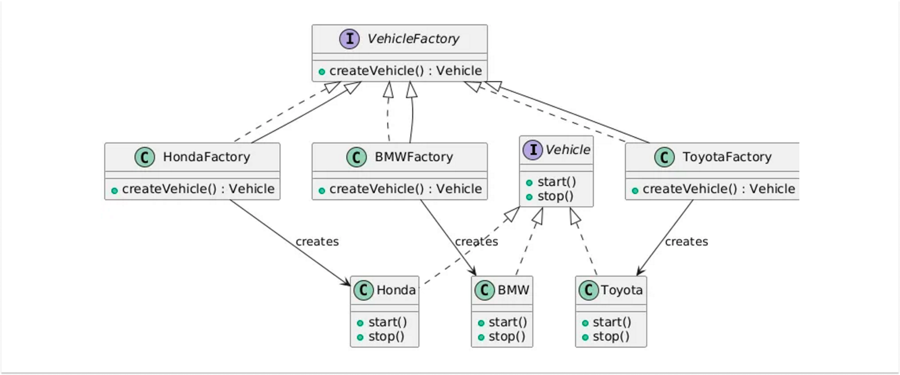

### Advantages of the Abstract Factory Pattern 🚀
• Easier to Extend:

Adding new car brands (or any other related products) is as simple as adding a new concrete factory. You don’t need to touch the client code or the existing factories.

‍
• Cleaner and More Maintainable:

Instead of modifying a large createVehicle method every time you need to add a new product, you encapsulate the logic in separate factory classes, making the system easier to maintain and extend.

• Consistency:

All objects in a family are created in a consistent manner. Whether it’s creating vehicles or furniture, the Abstract Factory ensures that all products created by a particular factory are related and compatible.

‍
### Real-life Use Cases and Examples 🏢

Here are a few places where the Abstract Factory pattern is commonly used:

• Cross-Platform UI Libraries:

If you’re developing a cross-platform application, you can use an Abstract Factory to create platform-specific UI elements (buttons, windows, textboxes) for Windows, Mac, or Android, ensuring consistency across platforms.

• Database Connections:

In a multi-database system, you can use an Abstract Factory to create database connections for different databases like MySQL, PostgreSQL, or MongoDB.

• Game Development:

In a game, you might have different families of objects like characters, weapons, and environments. The Abstract Factory ensures that all elements in a particular family (e.g., all weapons in a medieval game) are consistent.

### Factory Method vs. Abstract Factory
1. Purpose: 

- Factory Method: Creates one type of object.
- Abstract Factory: Creates families of related objects.

2. Scope: 

- Factory Method: Focuses on creating a single product.
- Abstract Factory: Creates multiple related products.

3. Abstraction Level: 

- Factory Method: Deals with one product type at a time.
- Abstract Factory: Deals with groups of related products.

4. Example: 

- Factory Method: A CarFactory creates one type of car.
- Abstract Factory: A VehicleFactory creates cars, trucks, and bikes of the same brand.

5. Flexibility: 

- Factory Method: Adding new products requires changing the factory.
- Abstract Factory: Adding new families doesn't affect existing code.

6. Use Case: 

- Factory Method: When you need to create a single object (e.g., one car model).
- Abstract Factory: When you need to create related objects (e.g., different vehicles from the same brand).

