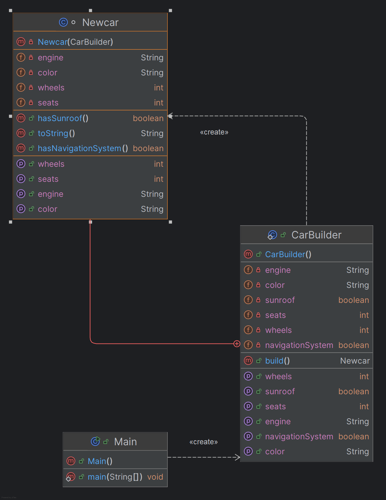

The Builder Design Pattern is an excellent solution for creating complex objects in a flexible, clear, and maintainable way. Unlike constructors, which can become messy and unmanageable with many parameters, the Builder pattern allows you to create objects step-by-step, setting only the attributes you care about. It provides default values, allows easy extensibility, and keeps the client code clean and understandable.

This pattern is ideal when you need to handle complex object creation without sacrificing flexibility or readability. Whether you're building cars, meals, or user profiles, the Builder Pattern ensures that objects are constructed in an organized, step-by-step manner.

### Real-life Use Cases of the Builder Pattern 🏗️

• Building Complex Meals 🍔:

Imagine creating a custom meal order (e.g., selecting burger size, toppings, drinks). The Builder Pattern lets you choose only the options you care about, making the process cleaner.

• Creating Documents 📑:

When creating complex documents (reports, articles), where sections might vary (like titles, images, or tables), the Builder Pattern helps assemble them step-by-step.

• User Profile Creation 👤:

When building user profiles in apps, where there are multiple options (name, email, preferences), the Builder Pattern allows customization without cluttering the code.

### UML Diagram

### Explanation of the Diagram:

1. Car Class: 

- Contains the attributes (engine, wheels, seats, color, sunroof, navigationSystem) and methods to retrieve them.
- The Car constructor is private, ensuring it is created only through the CarBuilder.

2. CarBuilder Class: 

- Has the same attributes as Car, but they are mutable, and it allows setting these attributes via builder methods.
- The build() method is used to create a Car object by passing the builder as a parameter to the Car constructor.

Relationships: 

- The CarBuilder is used by Car to construct a Car object, and the CarBuilder class returns a Car instance using the build() method.
- The CarBuilder class is nested inside the Car class.

‍

